1. Introduction to IoT Systems (Foundations)

Goal: Give students a system-level view before touching tools.

Topics

What is IoT? Definitions and real-world applications

IoT architecture:

Devices (sensors & actuators)

Gateway / Edge computing

Cloud / Backend

Applications & dashboards

IoT vs Cyber-Physical Systems (CPS)

Examples: Smart home, smart grid, smart cities

Lab link

Identify sensors (Broadlink) and actuators (TP-Link smart plugs)

Map them onto a basic IoT architecture diagram

2. Sensors & Actuators

Goal: Understand how physical-world data and control are handled.

Topics

Sensors:

Temperature & humidity fundamentals

Sampling rate, resolution, accuracy

Calibration and noise

Actuators:

Relays, smart plugs, on/off vs dimming

Energy consumption measurement (if supported)

Device constraints (power, connectivity, latency)

Lab ideas

Read temperature/humidity values in Node-RED

Turn TP-Link plugs ON/OFF based on sensor thresholds

Discuss sensor inaccuracies and delays

3. IoT Communication Protocols

Goal: Explain how devices talk to each other.

Topics

Network layers:

Wi-Fi vs BLE vs Zigbee vs Z-Wave

Application protocols:

HTTP / REST

MQTT (publish/subscribe model)

CoAP (brief overview)

Device discovery & local vs cloud control

Lab ideas

Node-RED flows using:

HTTP nodes

MQTT broker (local Mosquitto or cloud)

Compare polling vs event-driven updates

4. Node-RED as an IoT Middleware

Goal: Make Node-RED the core technical skill.

Topics

What is Node-RED and why it's used in IoT

Flow-based programming paradigm

Node types:

Input nodes (MQTT, HTTP, sensors)

Function nodes (JavaScript)

Output nodes (dashboards, actuators)

Context storage (flow, global, persistent)

Lab ideas

Build a complete flow:

Sensor → Function → Smart Plug

Use JavaScript logic for conditions

Debugging with Node-RED tools

5. Device Integration & APIs

Goal: Teach real-world integration challenges.

Topics

Vendor ecosystems (TP-Link, Broadlink)

Local vs cloud APIs

Reverse engineering & community nodes

Rate limits, authentication tokens

Device reliability & failures

Lab ideas

Integrate TP-Link smart plugs using Node-RED community nodes

Read Broadlink sensor data

Handle "device offline" scenarios

6. Data Handling & Storage

Goal: Move from automation to data-driven IoT.

Topics

Time-series data in IoT

Data formats: JSON, timestamps, metadata

Local vs cloud storage

Databases:

InfluxDB (time-series)

SQLite / MongoDB (intro)

Data retention policies

Lab ideas

Store temperature & humidity data

Visualize historical trends

Compute daily min/max/average values

7. Dashboards & Visualization

Goal: Turn data into insight.

Topics

Human–IoT interaction

Dashboards vs mobile apps

Visualization best practices

Node-RED Dashboard vs external tools (Grafana)

Lab ideas

Create a live dashboard:

Temperature & humidity gauges

Plug status indicators

Add control buttons (manual override)

8. Automation & Rule-Based Control

Goal: Core smart system behavior.

Topics

Rule-based logic

Event-driven vs time-based automation

Scheduling (cron, timers)

Hysteresis and stability (avoid oscillations)

Lab ideas

Turn plug ON if temp < X, OFF if temp > Y

Time-based automation (e.g., night mode)

Combine multiple conditions (temp + humidity)

9. Edge vs Cloud Computing in IoT

Goal: Critical design thinking.

Topics

Edge computing concepts

Latency, privacy, and reliability trade-offs

When to process locally vs in the cloud

Hybrid architectures

Lab ideas

Run Node-RED locally (Raspberry Pi / PC)

Compare local logic vs cloud-triggered logic

Discuss failure cases (internet down)

10. Security & Privacy in IoT

Goal: Extremely important and often neglected.

Topics

IoT threat model

Weak authentication & default passwords

Network segmentation (VLANs)

Secure communication (TLS, certificates)

Data privacy and GDPR implications

Lab ideas

Discuss vulnerabilities of smart plugs

Use authentication for Node-RED dashboard

Simulate an attack scenario conceptually

11. Energy Awareness & Sustainability (Very Relevant)

Goal: Add societal relevance.

Topics

Energy monitoring in smart homes

Load shifting and demand response

Energy-efficient automation strategies

IoT for sustainability

Lab ideas

Control plugs based on usage patterns

Minimize unnecessary standby consumption

Simple energy optimization rules

12. Scalability & System Design

Goal: Prepare students for real deployments.

Topics

From 1 device to 1,000 devices

Naming, addressing, and device management

Fault tolerance & logging

OTA updates (conceptual)

Lab ideas

Simulate multiple sensors in Node-RED

Design a scalable flow architecture

Discuss production vs prototype differences

13. Mini-Project / Capstone

Goal: Integrate everything.

Example project ideas

Smart room climate controller

Energy-aware smart plug scheduler

Environmental monitoring dashboard

Rule-based smart home assistant

Deliverables

Node-RED flows

Dashboard

Short technical report

Architecture diagram

```mermaid
flowchart TD
  ROOT["IoT Course Topics"]
  ROOT --> T1["1. Introduction to IoT Systems"]
  ROOT --> T2["2. Sensors & Actuators"]
  ROOT --> T3["3. IoT Communication Protocols"]
  ROOT --> T4["4. Node-RED as IoT Middleware"]
  ROOT --> T5["5. Device Integration & APIs"]
  ROOT --> T6["6. Data Handling & Storage"]
  ROOT --> T7["7. Dashboards & Visualization"]
  ROOT --> T8["8. Automation & Rule-Based Control"]
  ROOT --> T9["9. Edge vs Cloud Computing"]
  ROOT --> T10["10. Security & Privacy"]
  ROOT --> T11["11. Energy Awareness & Sustainability"]
  ROOT --> T12["12. Scalability & System Design"]
  ROOT --> T13["13. Mini-Project / Capstone"]
```

